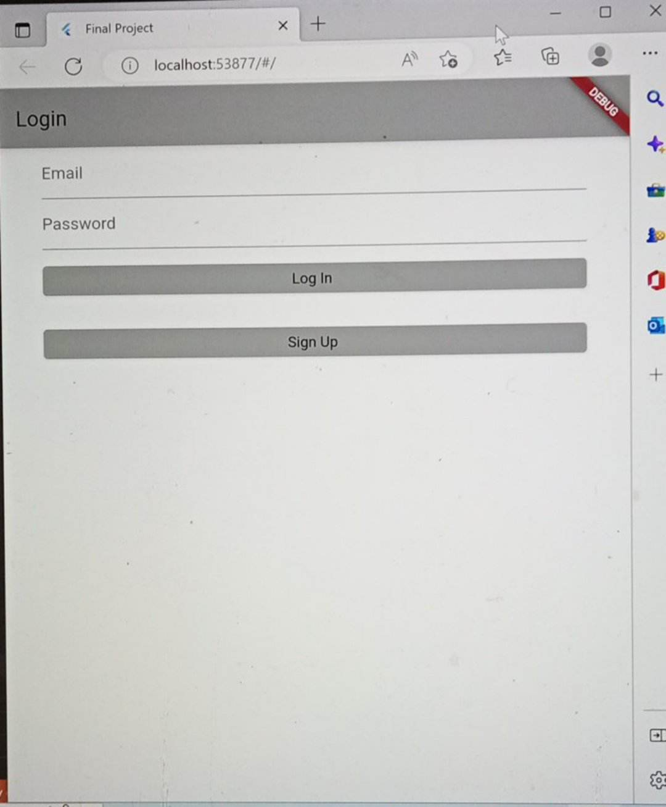
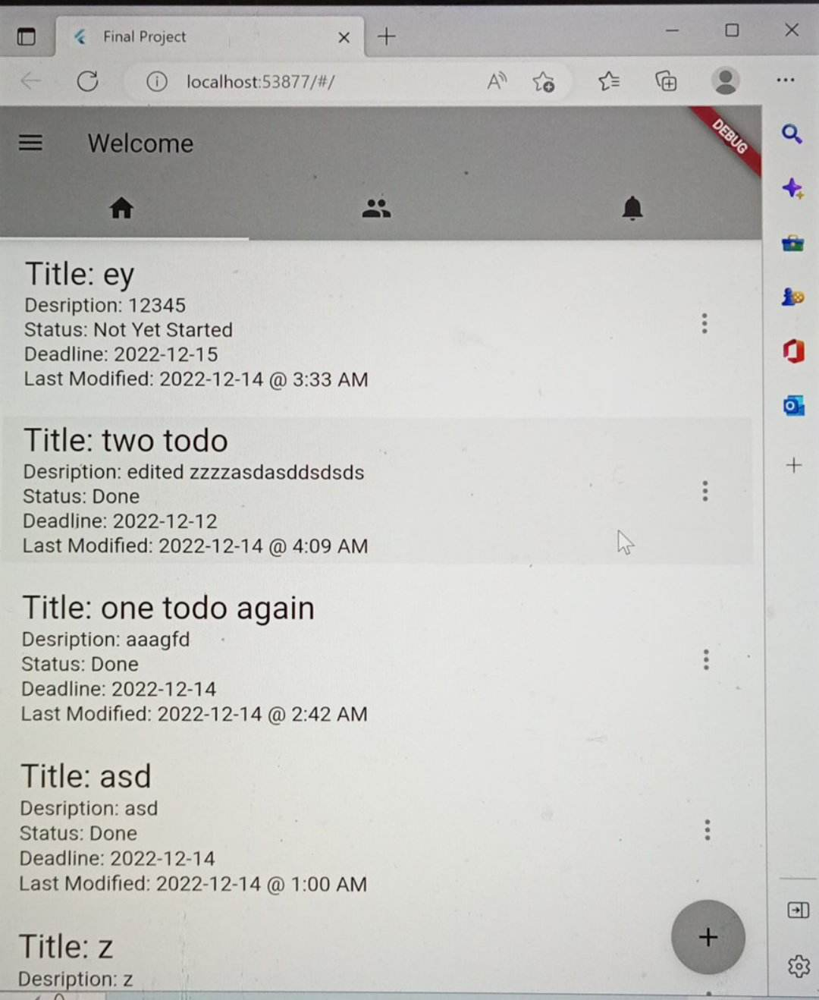
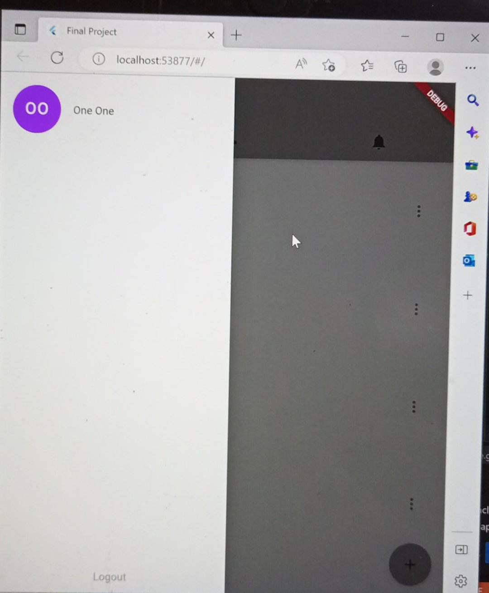
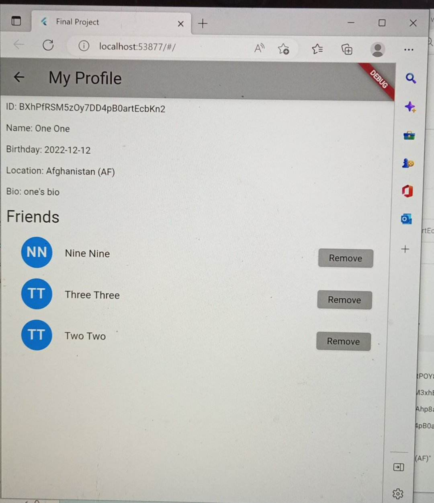
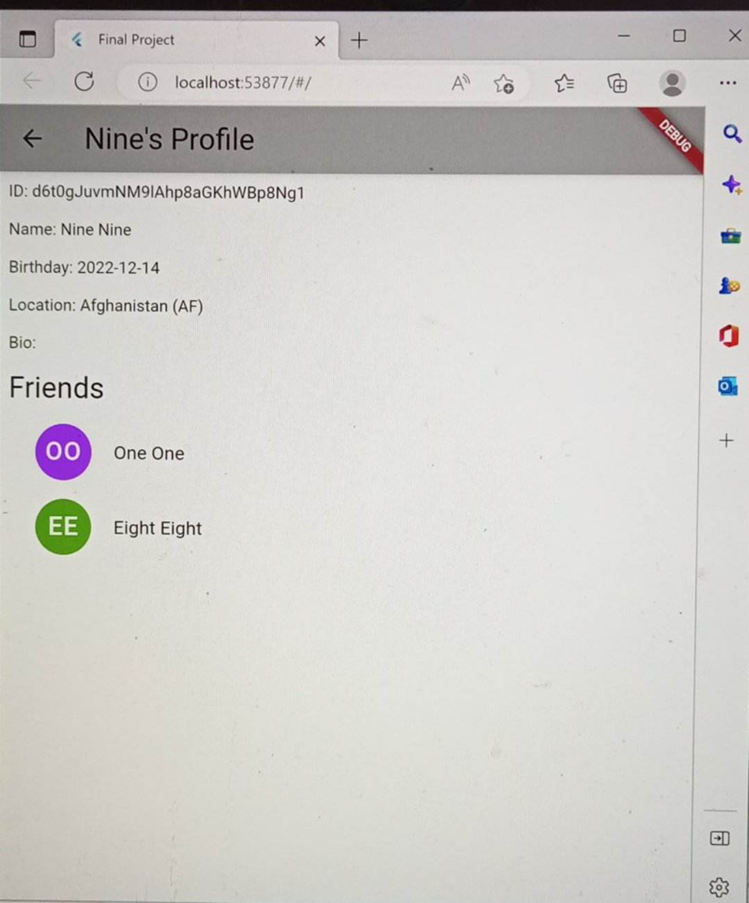
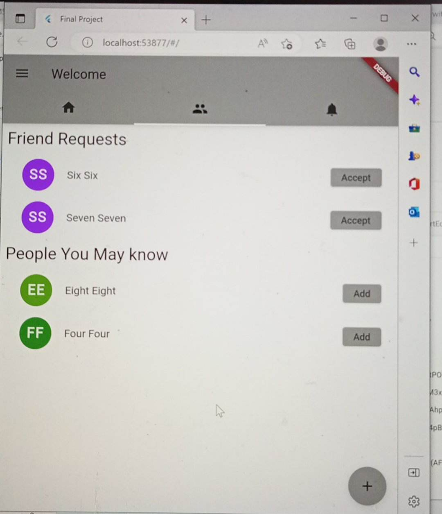
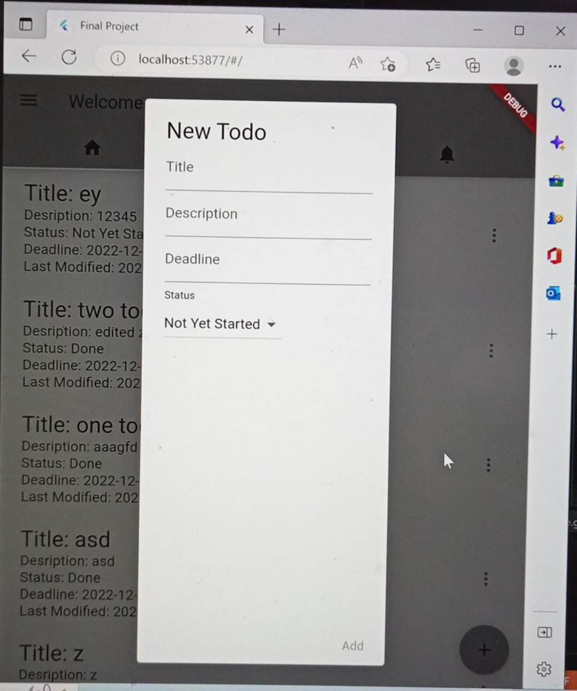
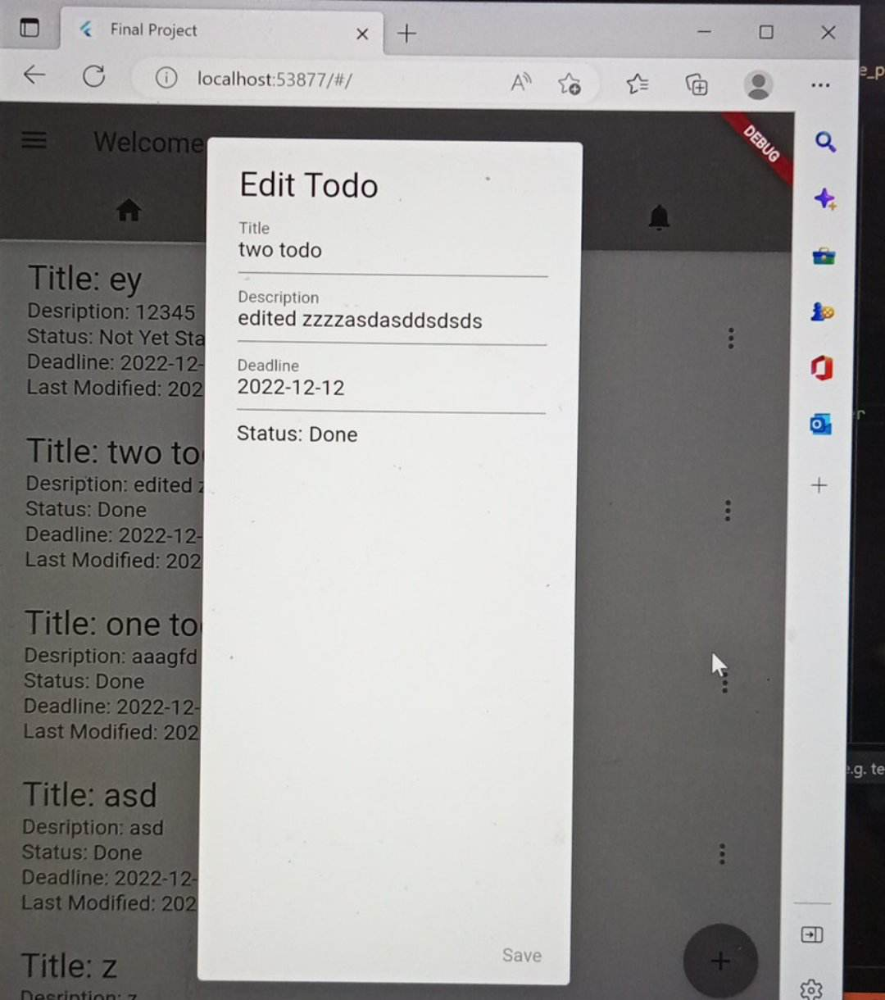
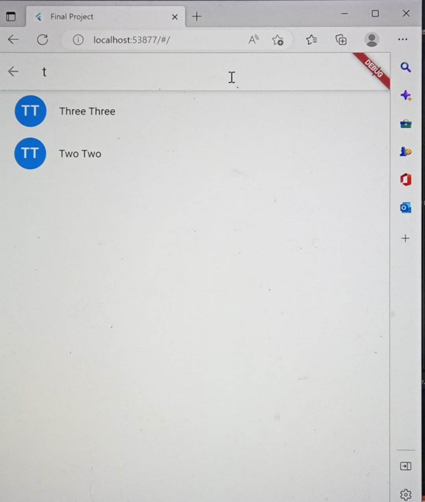
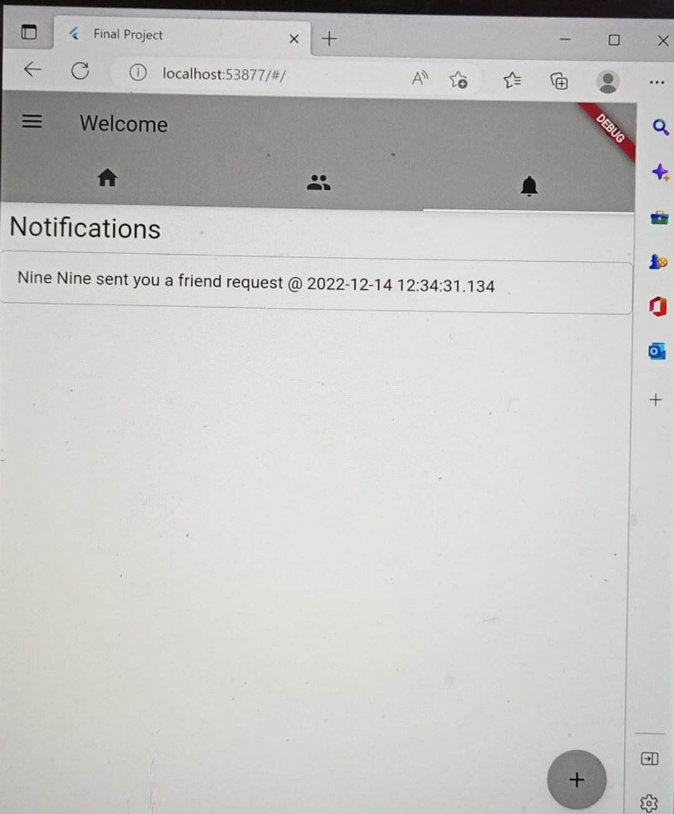

a. Student Information  
 i. Cid Ceradoy  
 ii. 2019-65142  
 iii. C5-L  
b. App Description  
 This mobile application is like a social media platform where users can interact with each other  
 by sending ang accepting friend requests. A user can also post a todo that can be edited by him and  
 his friends. 
c. Screenshots  
Login
  
Signup  
  
Home  
  
Drawer  
   
My Profile  
  
Friend's Profile  

Friend's Page  
  
New Todo  
  
Edit Todo  
  
Search Friends  
  
Notifications  
       